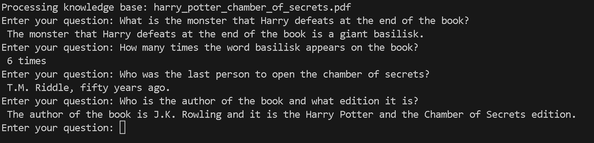

# Knowledge Base Chatbot

[](https://opensource.org/licenses/MIT)

## Overview

This Python application is designed to process knowledge base files and provide question-answering capabilities based on the content of the respective files. It uses machine learning techniques and the OpenAI API to extract text, create embeddings, and find relevant answers to user queries within the document.

`Below is an example using the Harry Potter - Chamber Of Secrets as the knowledge base. Keep in mind that the Open AI model used is the most basic one, so the answers are not always accurate.`



You can use this application to build your own knowledge base chatbot. Simply replace the PDF file with your own and you're good to go!

In the future this application will provide multiple files/folders support.

## Features

- Extracts text from PDF files and splits it into manageable chunks.
- Generates embeddings using OpenAI's language model.
- Builds a search index for efficient document search.
- Utilizes a pre-trained question-answering chain to find answers within the document.
- Provides a user-friendly command-line interface for interacting with the application.

## Installation

1. Clone the repository:

   ```shell
   git clone https://github.com/1andre-santos1/knowledge-base-chatbot.git
   cd knowledge-base-chatbot
   ```

2. Install the required dependencies:

   ```shell
    pip install -r requirements.txt
   ```

3. Obtain an API key from OpenAI by signing up for an account.

4. Update the config.yml file with your OpenAI API key and the pdf file path.

## Usage

`! Before running the application, please refer to the official documentation on usage limits. Every prompt will cost you X amount so it's best to set up a budget so you are not caught by surprise. In this application we're using the default model by Open AI`

1. Make sure you have activated the virtual environment or installed the dependencies (as mentioned in the Installation section).

2. Run the application:

   ```shell
   python main.py
   ```

3. Enter your question when prompted.

4. The application will search for relevant answers within the PDF document and display them on the console.

## Contributing

Contributions to this project are welcome and encouraged! If you have any ideas, improvements, or bug fixes, please follow these steps:

1. Fork the repository.

2. Create a new branch for your feature/fix:

   ```shell
   git checkout -b feature/branch-name
   ```

3. Commit your changes:

   ```shell
    git commit -m "Add a descriptive commit message"
   ```

4. Push your changes to the branch:

   ```shell
   git push origin feature/branch-name
   ```

5. Open a pull request on GitHub and provide a detailed description of your changes.

## License

This project is licensed under the terms of the MIT license.
